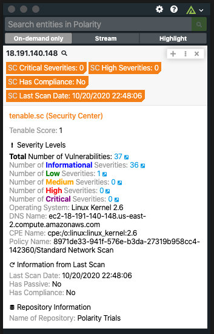
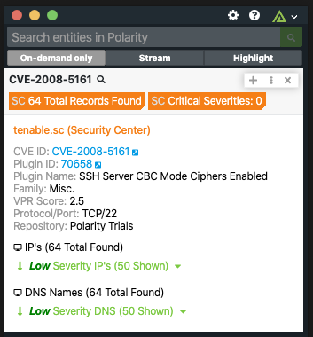
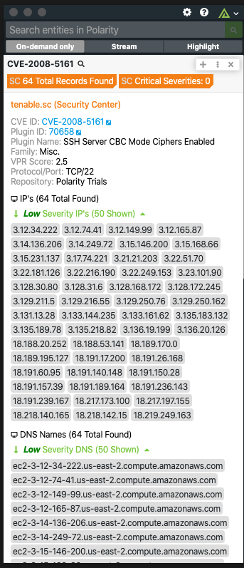

# Polarity tenable.sc Integration

The Polarity Tenable Security Center (formerly Tenable.sc) integration allows Polarity to search the tenable.sc API to return information IP addresses and CVEs.

> Starting in version 5.21 of Tenable.sc searching hosts by domains is not supported via the REST API.  As a result, the integration has removed support for domain lookups starting in the 3.1.1 release.

Check out the integration below:

## IP Searching

  

## CVE Searching

  
  

To learn more about tenable.sc, please visit: [official website](https://www.tenable.com/products/tenable-sc)

## tenable.sc Integration Options

### tenable.sc URL
Base URL for tenable.sc, please ensure to include the schema and any ports if necessary.

### tenable.sc Username
tenable.sc Username. Please ensure the user has the appropriate access to the API.

### tenable.sc Password
Valid password associated with the tenable.sc user.

### Max Concurrent Requests
Maximum number of concurrent requests.  Integration must be restarted after changing this option. Defaults to 20.

### Minimum Time Between Lookups
Minimum amount of time in milliseconds between lookups. Integration must be restarted after changing this option. Defaults to 100.

## Installation Instructions

Installation instructions for integrations are provided on the [PolarityIO GitHub Page](https://polarityio.github.io/).

## About Polarity

Polarity is a memory-augmentation platform that improves and accelerates analyst decision making.  For more information about the Polarity platform please see:

https://polarity.io/
